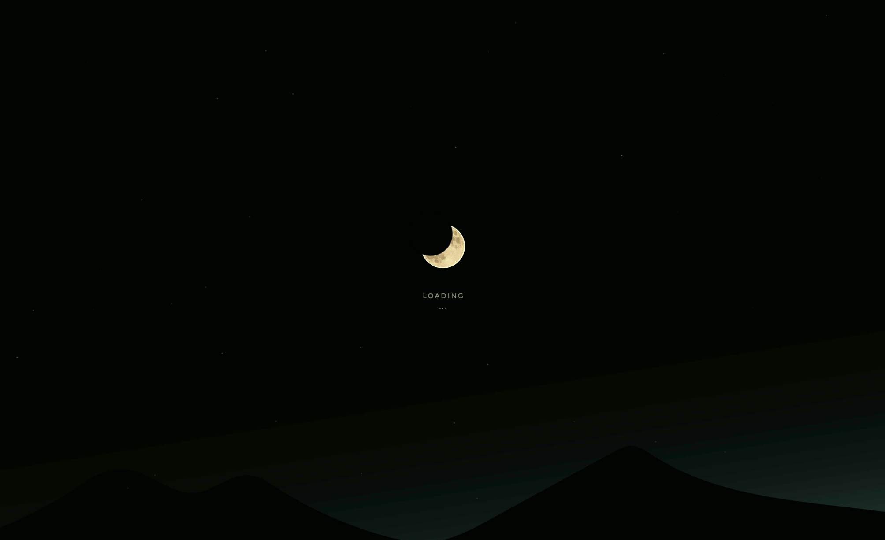

# Lunar Preloader

A CSS-only animated preloader featuring a glowing moon and falling meteors.  
The background landscape and stars were hand-drawn in Adobe Illustrator.  
No JavaScript is used. 

## Live Demo  
 https://sunnyju318.github.io/lunar-preloader/

## Features
- Glowing animated moon with CSS color transitions
- Falling meteor effects using CSS keyframes
- Inline SVG stars drawn by hand
- Background illustration created in Illustrator
- Pure HTML and CSS implementation

## Built With
- HTML5
- CSS3 (keyframes animation, positioning, blend modes)
- Inline SVG (stars)

## Folder Structure
```
lunar-preloader/
├── index.html
├── css/
│   └── stylesheet.css
├── img/
│   ├── background.jpg
│   ├── luna.png
│   └── stars.svg
```

## Preview


## Author
Jisun Ju (sunny)
